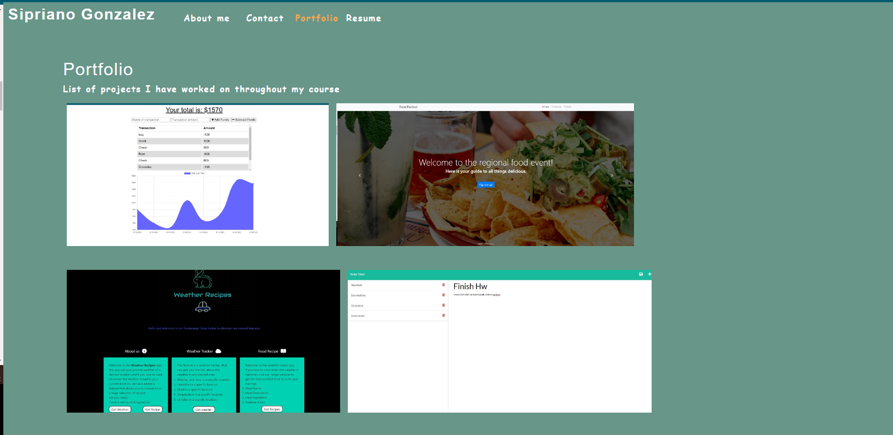

# Budget Tracker Starter Code  


  ## Table of Contents
  -[Description](#description)
  -[Install](#install)
  -[Usage](#usage)
  -[Collaborators](#collaborators)
  -[Instructions](#instructions)
  -[Licenses](#licenses)
  -[Questions](#questions)

  ### Description
```
AS AN employer looking for candidates with experience building single-page applications
I WANT to view a potential employee's deployed React portfolio of work samples
SO THAT I can assess whether they're a good candidate for an open position
```


Here is a screenshot of the application 
[]

  ### Install
  Download from my repo, run npm init, npm i, and then run on your local server using React. This server runs on localhost:3000

  ### Usage
  View the deployed site using the link below:
    https://sipg789.github.io/athena/

  ### Collaborators
  none

  ### Instructions
  This website is a source for all of my projects and a view of who I am as a developer. 


  ### Licenses 
  Apache2.0

  ### Questions
  Feel free to contact me at:
  GitHub: "https://github.com/SipG789/athena"

